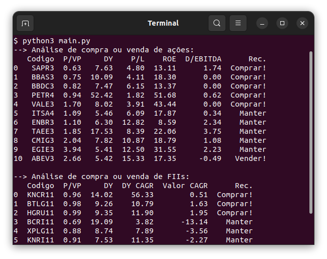

# Analisador de ações e fundos imobiliários

Programa para análise de compra ou venda de títulos na Bolsa de Valores baseado em informações fundamentalistas.

## Apoie esse projeto! 💵

Você pode realizar doações de qualquer banco para minha chave Pix: **565a756e-b163-47a8-8414-efa230057600**

## Pre-requisitos

Para executar o programa é necessário ter instalado o ambiente Miniconda.
Faça o download do instalador do Miniconda adequado para o seu sistema operacional na página de download do Miniconda (<https://repo.anaconda.com/miniconda>).

Após a instalação do Miniconda, entre no diretório do projeto e digite o comando abaixo para criar o ambiente virtual bem como as dependências do projeto:

    conda env create

Ative o ambiente com o comando:

    conda activate bolsa-analisador-env

Após ativar o ambiente `bolsa-analisador-env`, para a execução da aplicação, deve-se executar o seguinte comando abaixo no diretório do projeto:

    python3 main.py

## Critérios iniciais para seleção de ativos

Primeiro, são selecionados os melhores ativos com base nos critérios abaixo.
Estes ativos são salvos nos arquivos `data/acoes.csv` e `data/fiis.csv` para que o programa analise a compra ou venda.

Para ações, os critérios são:

- Ter, pelo menos, 10 anos de bolsa de valores (empresa consolidada);
- Não possuir histórico de corrupção;
- Possuir lucros consistentes (de 5 anos);
- A ação deve ser do tipo ordinária (ON);
- A cotação tentar acompanhar o lucro.

## Critérios de segurança utilizados para recomendação

### Ações

O programa recomenda a compra se todos os critérios abaixo forem verdadeiros:

- P/VP < 2
- Dividend Yield > 6
- P/L < 6.5
- ROE > 13%
- Dívida líquida / EBITDA < 3

O programa recomenda a venda se, pelo menos, um dos critérios abaixo for verdadeiro:

- P/VP < 0 ou > 10
- P/L < 0 ou > 15
- ROE < 3
- Dívida líquida / EBITDA > 4

### Fundos imobiliários

O programa recomenda a compra se todos os critérios abaixo forem verdadeiros:

- P/VP < 1.1
- Dividend Yield > 7
- DY CAGR > 4
- Valor CAGR > 0

O programa recomenda a venda se, pelo menos, um dos critérios abaixo for verdadeiro:

- P/VP > 1
- Dividend Yield < 5

## Contribuindo

Se você encontrar um problema ou quiser melhorar o código, ou até mesmo melhorar o conteúdo, você pode:

- [Abrir um problema](https://github.com/cfgnunes/bolsa-analisador/issues/new) descrevendo o erro ou a ideia de uma funcionalidade nova;
- Criar um _fork_ do projeto, realizar mudanças, e submeter um _pull request_.
